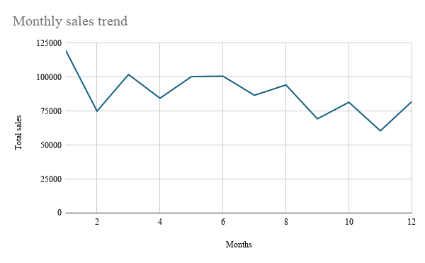
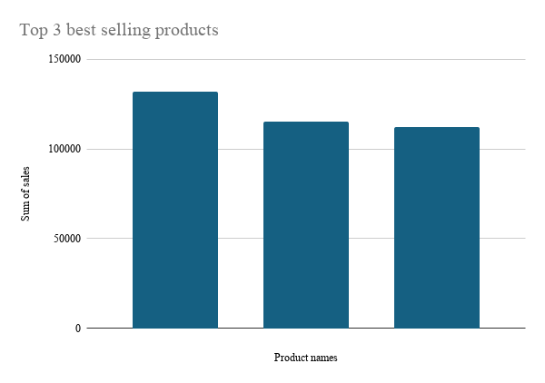
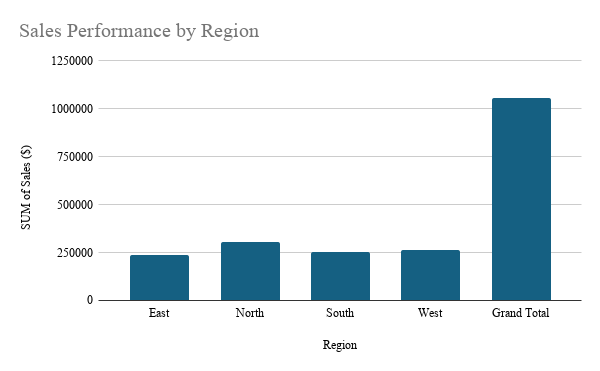

# Sales-Performance-Analysis
Sales data analysis project with cleaning, EDA and dashboard
# Sales Performance Analysis

## Project Overview
This project analyzes sales data to identify trends, top-performing products, and regional sales performance. The goal is to generate business insights from the dataset.

## Tools Used
- Excel
- Google Sheets
- GitHub

## Dataset Description
The dataset includes the following fields:
- Date
- Product
- Category
- Region
- Units Sold
- Sales ($)

## Analysis Performed
- Data cleaning
- Duplicate checks
- Summary statistics
- Monthly sales trend analysis
- Top-selling product analysis
- Regional sales performance analysis

## Visualizations

### Monthly Sales Trend

### Top 3 Best-Selling Products

### Sales Performance by Region

## Business Insights
- Monthly sales show fluctuations across the year.
- Some products contribute more to overall revenue than others.
- Regional sales vary, indicating opportunities for targeted strategies.
- Sales ($) column was treated as revenue for analysis.

## Conclusion
This project demonstrates Excel-based data analysis including cleaning, aggregation, and visualization. It forms part of my data analytics portfolio.

## Author
Njeri Ndungu
